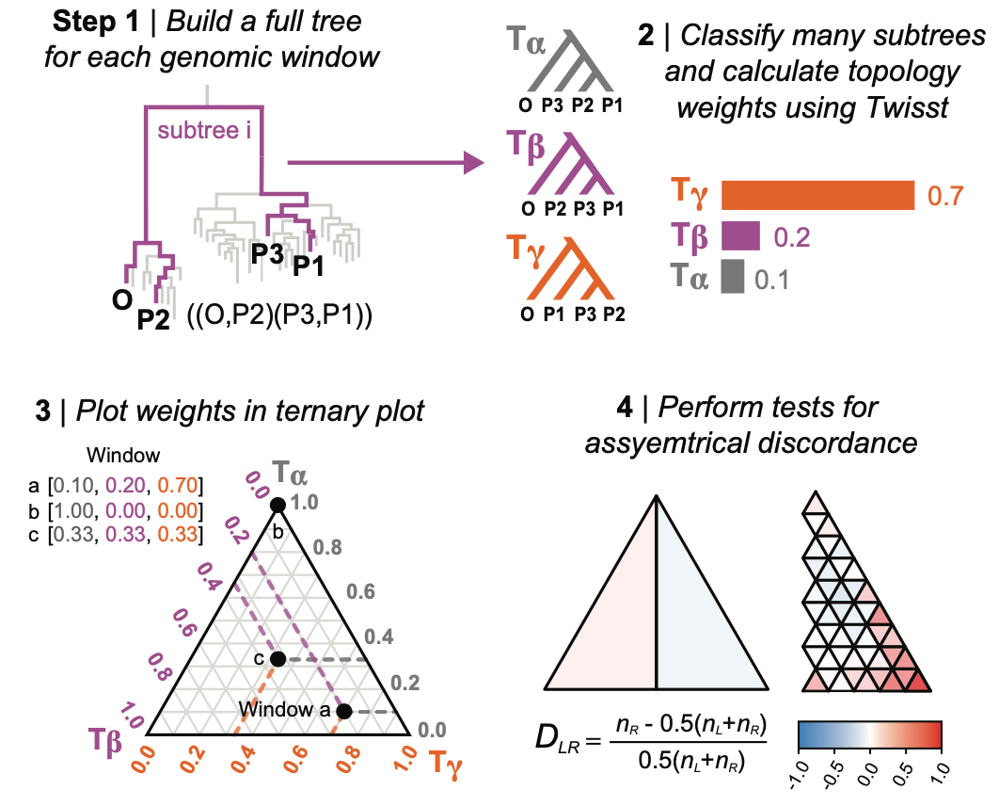
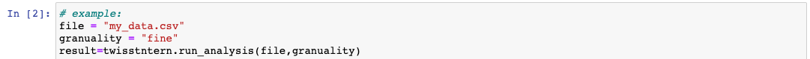

## A method for analysing topology weights in a ternary framework

TwisstNTern is an analytical framework for visualising and analysing topology weights in a ternary plot. Please note that TwisstNTern does not calculate topology weights; These must be calculated beforehand using the program Twisst (Martin & Van Belleghem 2017 https://doi.org/10.1534/genetics.116.194720): https://github.com/simonhmartin/twisst

## What does TwisstNTern do?
In a tree with four populations, there are only 3 possible unrooted subtrees that can be observed for each sampled subtree. This makes a ternary plot a natural framework for analyzing the joint distribution of weights, as it is possible to graphically represent of each genomic window as a single point based on the three topology weights.


The three corners of the ternary plot, [1,0,0], [0,1,0], [0,0,1], correspond with genomic windows that show taxon-level relationships that are consistent with one of the three possible subtrees; that is, 100% of the sampled subtrees (in our case 10,000) perfectly match one of the three alternative trees, implying that samples from each of the four groups are monophyletic (Fig. 2A). In contrast, the very center of the ternary plot—[0.33,0.33,0,33]—corresponds with a genomic window where all three of the possible subtrees were sampled at equal frequency. Any other location in the ternary plot indicates a bias toward one of the subtrees, but with some resemblance to at least one of the other alternative topologies.


In an idealized four population model (3 splits with no migration), we expect the distribution of weights for many loci to be biased toward the top of the triangle which represents the subtree that matches the demographic history. Incomplete lineage sorting will generate a symmetrical distribution of weights between the left and right sides of the plot. This is because there is an equal chance that any discordant gene tree will more-closely resemble either alternative topology. However, processes like gene flow result in an asymmetrical pattern of discordance between the left and right halves of the triangle. The strength of the genealogical asymmetry (and its significance) can be quantified using the Dlr statistic, which is similar to the site-based statistic, Patterson’s D. Dlr can be calculated at the genome-wide scale (two full half-triangles), or between left-right sub-triangles so that one can see how the strength of the asymmetry varies among loci that show different levels of discordance. 





## Papers
Stankowski et al 2023 is where we first used the TwisstNTern method to study patterns of tree discrodnace in _Littorina_ 

If you use TwisstNTern, please cite:
Stankowski, S., Z. B. Zagrodzka, M. Garlovsky, A. Pal, D. Shipilina, D Garcia Castillo, T. Broquet, E. Leader, J. Reeve, K. Johannesson, A. M. Westram, R. K. Butlin. 2023. Selection on many loci drove the origin and spread of a key innovation. _bioRxiv_ doi: https://doi.org/10.1101/2023.02.13.528213

## Running TwisstNtern
At present, TwisstNTern must be exectud within a Jupyter notebook. If you do not currently use Jupyter notebooks, you might want to try installing Anaconda Navigator https://docs.anaconda.com/free/navigator/index.html. Once installed you can use this to lauch a jupyter notebook.

Assuming that you already know how to execute a Jupyter notebook, you can follow the following steps.

1) Download the TwisstNTern repository, and move your input file into the directory
2) Open the jupyter notebook `twisstntern_user_interface.ipynb`. Do not modify any other file in the directory.  
3) In cell 2, change `file` so it matches the name of your input file, and set `granularity` to the desired resolution (see Granularity section below). `granularity` determines the number of subtriangles used in the local symmetry analysis. We provided 3 preset options `coarse`, `fine`, and `superfine`. See below for more information. 
4) Press the double arrow button to restart the kernal and run all cells.
5) The results will be written to a folder called `results` in your local directory (See Output section below)

## Choosing the most appropriate granularity
The most appropriate granuliaty for your dataset will depend on the number of genomic regions analysed and the dispersion of the data aross the ternary plot. For most WGS studies where the genome has been sectioned into block of arbitrarty size or SNP number, the `fine` option is a good place to start. Emerging tools like the ARG can produce very large numbers of marginal trees, so the `superfine` options may be suitable. Studies with reduced representation datasets may have fewer loci than the average WGS study, so `coarse` may be a more apporpriate option. Similarly, in systems where there is fairly high gene tree-sepecies tree concordance, the distribution of weights may be restricted to a fairly small section of the ternary plot, so `superfine` may be more appropriate.

## Input file
The input file is a .csv file consisting of three columns of counts of each tolpology. This is produced by Twisst. The headers can be any arbitrary name. The ctirical thing for the twisst analysis is that the weights for the species tree toplogy (or topology matches the genome-wide tree or inffered demographic history) should be in column 1; the other 2 columns represent the 2 alternative subtrees. It does not matter which alternative topology goes in which column, and this can be changed to switch these between the left and right sides of the ternary plot. 

```
topo1,topo2,topo3
2850,1650,5500
0,2000,8000
582,632,8786
2800,3200,4000
2914,2529,4557
2264,5280,2456
3592,2192,4216
700,740,8560
3936,2568,3496
3936,2568,3496
```
## Output 
The program will generate a Results file comprising the following components:
1. CSV Results Table: This file contains the results of the analysis in CSV format. 
4. Results Summary Plot: A plot displaying the results with D_lr results together with significant G-test scoring.
5. Genome-wide asymmetry Plot: A plot showcasing the asymmetry between the left and right halves of the full triangle.
n. Subtriangles Index Plot: An index plot with distinct numbers assigned to each subtriangle for clear visualization. These numbers correspond to the indices in the results file.
3. Ternary Coordinates Plot: A plot of the data in ternary coordinates.

