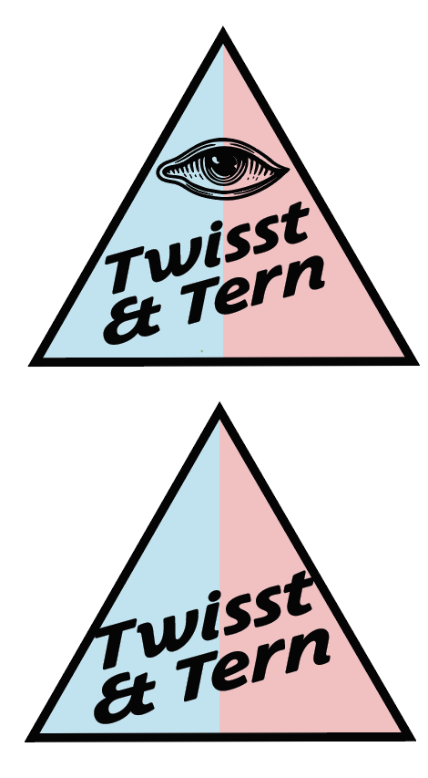

# TwisstNTern



## A method for analysing topology weights in a ternary framework

sean to write

## Papers
Stankowski et al 2023 is where we first used the TwisstNTern method to study patterns of tree discrodnace in _Littorina_ 

Stankowski, S., Z. B. Zagrodzka, M. Garlovsky, A. Pal, D. Shipilina, D Garcia Castillo, T. Broquet, E. Leader, J. Reeve, K. Johannesson, A. M. Westram, R. K. Butlin. 2023. Selection on many loci drove the origin and spread of a key innovation. _bioRxiv_ doi: https://doi.org/10.1101/2023.02.13.528213

## Running TwisstNtern
There are two ways that you can run TwisstNTern on your data

### From the command line
1) Download twisstntern.py into your working directory; this should also include your input file of topology weights
2) Load python
3) Import the package
```bash
Import twisstntern
```
4) Execute the code
```bash
res=twisstntern.run_analysis(datafile, granularity)
```


