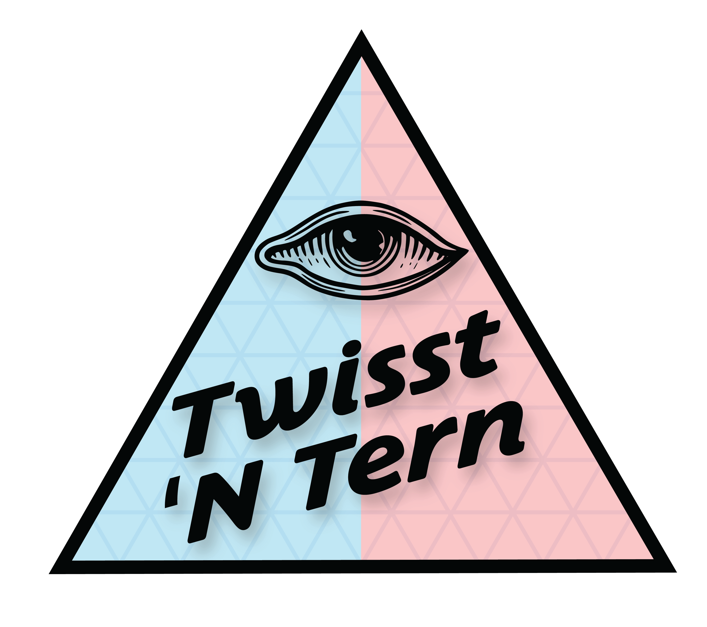

# TwisstNTern

## A method for analysing topology weights in a ternary framework

## Papers
Stankowski et al 2023 is where we first used the TwisstNTern method to study patterns of tree discrodnace in _Littorina_ 

## Lets list what this is about

 * mention twisst method- 1,2 sentences
 * here the novalty is the usage of ABBA BABA on 3 tacsonomies
 *  tiny bit of how this code works

-CHECK OUT binder versus google colab- for opeening a functioning exmpale jupyter notebook.
- maybe this is not so important...

ex. for the binder link:

